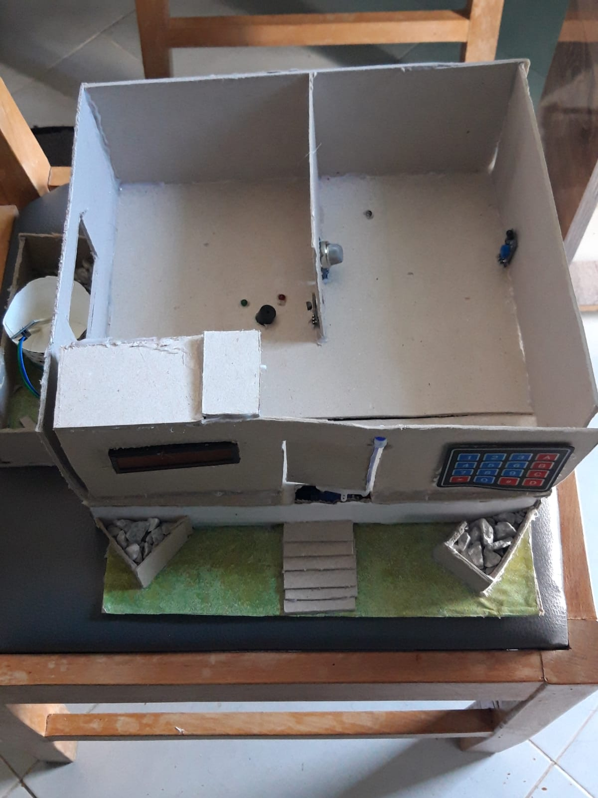

<h1 align="center"> SmartHome Project</h1>
<p align="center">
  <br>
</p>


<h1 align="center">Abstract</h1>
The concept of a smart home, in which various appliances and systems can be controlled
and monitored remotely, has become increasingly popular in recent years. One popular method
for implementing a smart home is to use an Arduino microcontroller. The Arduino is a small,
affordable, and easy-to-use microcontroller that can be programmed to control and interact with
a variety of sensors and actuators.
In this projet, we present a smart home system that uses an Arduino Mega microcontroller to
control and monitor various appliances and systems. The system includes temperature and light
sensors, which are used to adjust the temperature and lighting in the home, as well as motion
sensors, which are used to detect movement and trigger alarms. Additionally, we also explore
the use of actuators, such as LED lights and motors, to control various aspects of the home,
such as opening and closing blinds.
The system is designed to be easy to use and requires minimal programming knowledge.
The code for the system is open-source and can be easily modified to suit the needs of the user.
The system is also designed to be expandable, meaning that additional sensors and actuators can
be added as needed. Overall, this projet demonstrates the feasibility of using an Arduino Mega
microcontroller to control and monitor various appliances and systems in a smart home. The
system is easy to use, affordable, and expandable, making it a suitable option for those looking
to implement a smart home.


<h1 align="center">Tasks</h1>
The requested tasks are as follows:
<ul>
	<ol>Measure the house temperature and display it on a screen (LCD), and if T > 40°C, trigger the fan (Servo motor).</ol>
	<ol>Turn on the red LED and activate an alert (buzzer) if the gas or flame sensor detects fire or gas; otherwise, turn on the green LED.</ol>
	<ol>Measure the soil water level using the humidity sensor and display it on the screen (LCD). Turn on a red LED if the level is below a set threshold.</ol>
	<ol>Turn on the house lights (two LEDs) if the PIR motion sensor detects the presence of a person.</ol>
 	<ol>For security reasons, we use a digital door lock for our smart home. Use the 4x4 keypad to enter the code you have predetermined in the Arduino code. If the code is correct, open the door (servo motor); otherwise, display a text on the LCD screen.
</ol>

</ul>


<h1 align="center">HARDWARE</h1>
<ul>
	<li>A temperature sensor (LM35)</li>
	<li>A gas sensor (MQ6) </li>
	<li>A flame sensor</li>
	<li>A soil moisture sensor</li>
        <li>A PIR motion sensor</li>
        <li>I2C 1602 LCD</li>
	<li>4x4 keypad compatible with ARDUINO</li>
	<li>Servo motor SG90 (x2)</li>
	<li>Buzzer (x2)</li>
	<li>LED (red x1, green x1, other color x2)</li>
	<li>ARDUINO Mega</li>
</ul>

<h3>Code</h3>
<p>The code of our project is presented below for your reference :</p>

```


#include<LiquidCrystal.h>
#include <Keypad.h>
#include <Servo.h>
//Constants
#define ROWS 4
#define COLS 4
#define  flamePin 30

//Parameters
Servo monServomoteur;
Servo monServomoteur1;
const char kp4x4Keys[ROWS][COLS] 	= {{'1', '2', '3', 'A'}, {'4', '5', '6', 'B'}, {'7', '8', '9', 'C'}, {'*', '0', '#', 'D'}};
const char doorKey[4]="1234";
 char code[4];
char k;
int capteur;  // Pour enregistrer la valeur de A0
float temperature;
int buzzer= 28;
int gaz;
int flamme;

int ligne = 0;
int colonne = 0;
int comp=1;
byte rowKp4x4Pin [4] = {51, 49, 47, 45};
byte colKp4x4Pin [4] = {43, 41, 39, 37};
const int pirPin  = 22;
const int ledPin = 26;
const int ledPin1 = 24;
const int ledPin2 = 23;
const int ledPin3 = 21;
const int PIN_RED   = 34;
const int PIN_GREEN = 32;
const int PIN_BLUE  = 36;

int PinAnalogiqueHumidite=A0;  
int hsol;

//Variables
bool pirStatus  = false;

//Variables
Keypad kp4x4 	= Keypad(makeKeymap(kp4x4Keys), rowKp4x4Pin, colKp4x4Pin, ROWS, COLS);
const int rs = 12, en = 11, d4 = 5, d5 = 4, d6 = 3, d7 = 2, ct=9,bla;
LiquidCrystal mylcd(rs, en, d4, d5, d6, d7);

void setup() {
   pinMode(PIN_RED,   OUTPUT);
  pinMode(PIN_GREEN, OUTPUT);
  pinMode(PIN_BLUE,  OUTPUT);
   pinMode(pirPin, INPUT);
  pinMode(ledPin, OUTPUT); 
  pinMode(ledPin1, OUTPUT);  
   digitalWrite(bla, HIGH);

  pinMode(A2, INPUT);
  pinMode(PinAnalogiqueHumidite, INPUT); 
analogWrite(ct,50);
mylcd.begin(16, 2);
monServomoteur.attach(10);
monServomoteur1.attach(6);
delay(1000);
Serial.begin(9600);
   

}
int i=0;
void loop(){
  int contrastValue = analogRead(ct); // read the potentiometer value
  contrastValue = map(contrastValue, 0, 1023, 0, 255); // map the value from 0-1023 to 0-255
  analogWrite(ct, contrastValue); // send the mapped value to the LCD's
  opendoor();
  readPIR();
  gazandflam();
  humid();
  temp();
}
   void opendoor(){
     
      
char key = kp4x4.getKey();
   
    
  if (key != NO_KEY) {
       
    if (i < 4) {
     if(key!='A'&& key!='B'&& key!='C' && key!='D'){
        
      code[i] = key;
      mylcd.print(code[i]);
  
      
      i++;} 
      
    }
    
    if (i == 4) {
      for (int j = 0; j < 4; j++) {
        if(code[j]!=doorKey[j]){
         comp=0;          
        }
      }
    if(comp==1){
     mylcd.clear();
    
     mylcd.print("acces") ;
     for (int position = 0; position <= 90; position++) {
    monServomoteur.write(position);
    delay(15);
  }
   delay(2000);
  // Fait bouger le bras de 180° à 10°
  for (int position = 90; position >= 0; position--) {
    monServomoteur.write(position);
    delay(15);
  } 
     
      mylcd.clear();
      
    }
    if(comp==0){
       mylcd.clear();
      
     mylcd.print("acces denied")  ; 
      delay(2000);
      mylcd.clear();       
     
    }
      i = 0;
      comp=1;
     
   
  }
  if(key=='A'){ 
    mylcd.clear();
     mylcd.setCursor(0,1);
    mylcd.print("T=");
    mylcd.print(temperature-486);
    mylcd.setCursor(8,1);
    mylcd.print("H=");
    mylcd.print(hsol);
    
  }
  if(key=='B'){ 
    for (int j = 0; j <= 5; j++) {
    
    for (int position = 0; position <= 180; position++) {
    monServomoteur1.write(position);
    delay(5);
  }}
    
  }
   if(key=='C'){ 
    mylcd.clear();
     
    
  }
  if(key=='D'){
    
   rgb();
   rgb();
   rgb();
   rgb();
  
  }
  }
   
   }
   void readPIR( ) { /* function readPIR */
  ////Test routine for PIR
  pirStatus = digitalRead(pirPin);
  if (pirStatus) {   
    Serial.println("high");
    digitalWrite(ledPin2, HIGH);
  
  }else{
    digitalWrite(ledPin2, LOW);
    
  }
}
void gazandflam() {
   gaz = analogRead(A2);

  //flamme=digitalRead(flamePin);
  

   if (gaz >120  || flamme==1) { 

   //digitalWrite(buzzer, HIGH);
 // allume le buzzer actif arduino
  tone(buzzer,500);
  digitalWrite(ledPin, HIGH);
   digitalWrite(ledPin1, LOW); 
   
  }else{
  digitalWrite(ledPin, LOW);
   digitalWrite(ledPin1, HIGH);
   noTone(buzzer);
   
    }

  
}
void humid(){
 hsol = analogRead(PinAnalogiqueHumidite); // Lit la tension analogique
     
    if (hsol>800)
      {
           digitalWrite(ledPin, HIGH);
     
         
           
      }else if(hsol<800){
      
  digitalWrite(ledPin, LOW);
        
       }
    
}
void temp(){
  capteur = analogRead(A1);
  temperature = ((capteur * 5000.0) / 1023) / 100;
  
   
}
void rgb() {
  // color code #00C9CC (R = 0,   G = 201, B = 204)
  setColor(0, 201, 204);

  delay(500); // keep the color 1 second

  // color code #F7788A (R = 247, G = 120, B = 138)
  setColor(247, 120, 138);

  delay(500); // keep the color 1 second

  // color code #34A853 (R = 52,  G = 168, B = 83)
  setColor(52, 168, 83);

  delay(500); // keep the color 1 second
  
  // color code #8B0FF7 (R = 139,  G = 15, B = 247)
  setColor(139, 15, 247);

  delay(500); // keep the color 1 second

  // color code #8653C75 (R = 101,  G = 60, B = 117)
  setColor(101, 60, 117);

  delay(500); // keep the color 1 second
  
}

void setColor(int R, int G, int B) {
  analogWrite(PIN_RED,   R);
  analogWrite(PIN_GREEN, G);
  analogWrite(PIN_BLUE,  B);
}	
```

<h1 align="center">Simulation</h1>
<p>You can find the video demonstrating the project:</p>
(https://drive.google.com/file/d/1IrPB5lr-Z72NIShX7uRKxQu5Tsus6s-f/view?usp=sharing)
<h1 align="center">Team</h1>
<ul>
	<li> Ayoub Hsaine</li>
	<li> Achraf Rachid</li>
	<li> Mohamed Mouad Ouhasni </li>
	<li> Aymane Baddou</li>
	<li> Ilhame Soufi</li>

</ul>


